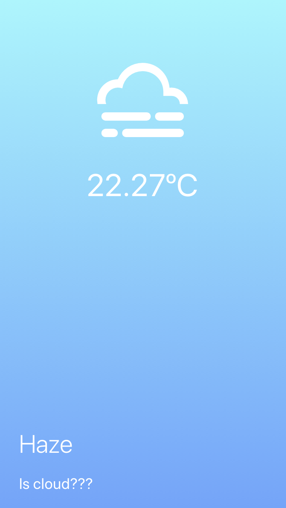

리액트 네이티브로 날씨앱을 만드는 강좌가 있길래 한번 만들어 봤다.    
만들기는 쉬운거 같은데 앱이 간단해서 그런거 같기도 하다. 유감이지만 컴퓨터가 맥이 아니라서 내 아이폰에는 앱을 넣을 수가 없었다. (가능하면 할일앱이나 캘린더앱 만들고싶음-_-;)

앱설명
---
현재 위치 정보와 날씨 정보를 가져와서 화면에 보여주는 앱

이런식으로 날씨와 온도를 보여주는 앱이다.

소스링크 <https://github.com/wood08/weather>  
참고강좌 <https://academy.nomadcoders.co/p/fucking-react-native-apps>